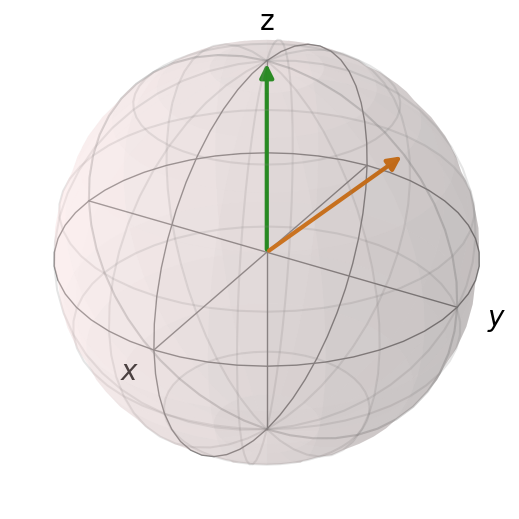
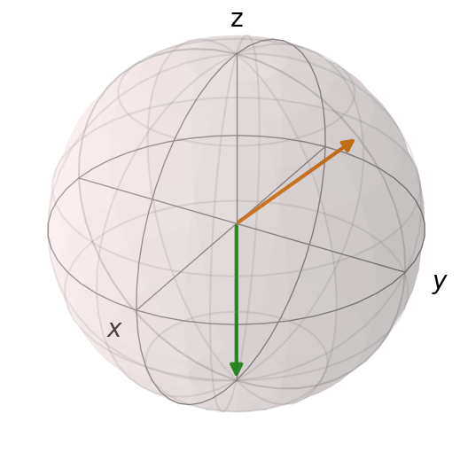

```python

```

# Abbreviated Midterm Module Showcase
#### Hannah Speckman - 05/05/26

The library I chose for my module showcase is Qutip. Qutip is a python package that allows you to model and operate on quantum objects. These objects include bras, kets, spin states, and density matrices, among others. Qutip includes many helpful ways to visualize, colorcode, and animate quantum simulations.

This code creates a model of a simple Bloch sphere. A Bloch sphere is a geometric visualization of a qubit's spin state, where the two arrows represent two spin states each with a different magnetic moment. The green arrow shows the spin up state with a magnetic moment oriented along the z axis, while the orange arrow shows a superposition state oriented between the +z and +y axes. I chose to code this example to show the core physical idea behind both the Stern-Gerlach experiment and magnetic trapping. That idea being, the behavior of an atom depends completely on the orientation of its spin state. On the Bloch sphere, the vector (0,0,1) represents the particle in the spin up state, while (0,0,-1) represents spin down. The orientation of a qubit's spin state determines whether the atom is attracted to or repelled from a magnetic minimum which is the basis of magnetic trapping. In the Stern-Gerlach experiment, the spin orientation determines the force that moves the particle one way or the other. This shows that the connection between the two concepts is at its core the orientation of the vectors illustrated in this Bloch sphere model.


```python
import matplotlib.pyplot as plt
import numpy as np
import qutip
from qutip import Bloch

z_up = np.array([0, 0, 1])
mu = np.array([0, 1, 1]) / np.sqrt(2)

bloch = Bloch()
bloch.zlabel=("z", "")
bloch.add_vectors([z_up, mu])
bloch.show()

z_dn = np.array([0, 0, -1])
mu = np.array([0, 1, 1]) / np.sqrt(2)

bloch = Bloch()
bloch.zlabel=("z", "")
bloch.add_vectors([z_dn, mu])
bloch.show()
```


    

    


    

    


## Resources:
Textbook
    
    Quantum Mechanics: A Paradigms Approach by David H. McIntyre

Qutip guides, documentation, examples and tutorials

    https://qutip.readthedocs.io/en/stable/guide/guide-basics.html
    https://github.com/hodgestar/stern-gerlach-qutip/blob/master/qutip-measurement.ipynb
    https://nbviewer.org/urls/qutip.org/qutip-tutorials/tutorials-v5/python-introduction/004_link_to_lecture_0.ipynb
    https://qutip.readthedocs.io/en/stable/guide/guide-states.html#expectation-values

