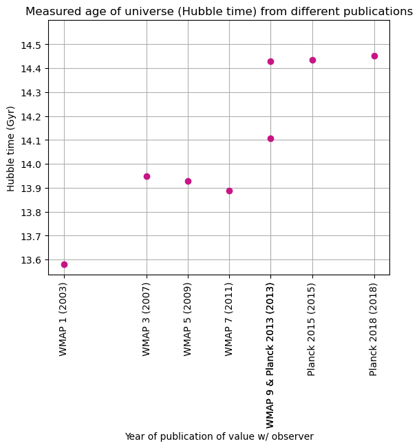

Astropy is a Python library designed for working with astronomical data for astronomy and astrophysics purposes with ease of use in mind. One of the modules within this library is astropy.cosmology, a module made for calculations and working with cosmological data that is either input by the user or stored within the library itself. The module has a number of included “cosmology realizations” that contain information about the universe (Hubble constant, baryon density, matter density, etc.) from different published sources that reference data collected by space probes and satellites. The module also includes a Units and Equivalencies section with that has built-in typical units used in astronomy for different quantities, a section on reading, writing, and converting cosmological objects, and a module called traits that contains information about properties and behaviors related to different cosmological quantities such as scale factors or the Hubble parameter which provides information about the Hubble constant. 

Below is an example of using information stored in Astropy to plot various models of the age of the universe to see how they compare over time. An estimate is made with this data regarding the age of the universe.

```python
import numpy as np
import matplotlib.pyplot as plt
from astropy.cosmology import WMAP1, WMAP3, WMAP5, WMAP7, WMAP9, Planck13, Planck15, Planck18 #importing different cosmology data from astropy
import astropy.units as u

W1 = WMAP1
W3 = WMAP3
W5 = WMAP5
W7 = WMAP7 #making cosmology names shorter for convenience
W9 = WMAP9
P13 = Planck13
P15 = Planck15
P18 = Planck18
```


```python
cosmols = [W1, W3, W5, W7, W9, P13, P15, P18] #list of pre-defined cosmologies
years = [2003, 2007, 2009, 2011, 2013, 2013, 2015, 2018] #list of years that data was published
labels = ["WMAP 1 (2003)", "WMAP 3 (2007)", "WMAP 5 (2009)", "WMAP 7 (2011)", ".", "WMAP 9 & Planck 2013 (2013)", "Planck 2015 (2015)", "Planck 2018 (2018)"]
ages = u.Quantity([cosmol.hubble_time for cosmol in cosmols]) #u.Quantity "represents the value of a number with some associated unit"
yticks = np.arange(13.5, 14.6, 0.1)
avg = np.mean(ages)

print("The average measured age of the universe from provided cosmologies is ~", avg,".")

plt.xticks(years, labels, rotation="vertical")
plt.yticks(yticks)
plt.xlabel("Year of publication of value w/ observer")
plt.ylabel("Hubble time (Gyr)")
plt.title("Measured age of universe (Hubble time) from different publications")
plt.plot(years, ages, "o", color = "mediumvioletred")
plt.grid(True)
plt.ylim(top = 14.6);
```

    The average measured age of the universe from provided cosmologies is ~ 14.09579576014095 Gyr .


    

    


Above is a list of different cosmologies inside of the astropy.cosmology module and their corresponding years published in literature for the sake of plotting the measured Hubble times over the years published. The cosmol.hubble_time function is pulling out the value of Hubble time from an associated model from the list of cosmologies. The u.Quantity function "represents the value of a number with some associated unit" for the Hubble times. The next section of the code block plots the Hubble time values against the years they were published.

It appears that over time the estimates for measured age of the universe have shifted from ~13.5-14 Gyr to more recently converging to ~14.5 Gyr. The current best estimate for the age of the universe based on an average of measured Hubble times appears to be ~14.1 Gyr.

References

* NASA. (2025, August 4). The Hubble Constant and Hubble Tension. NASA. https://science.nasa.gov/mission/hubble/science/science-behind-the-discoveries/hubble-constant-and-tension/ 
* Wikipedia contributors. (2026, April 26). Planck (spacecraft). In Wikipedia, The Free Encyclopedia. Retrieved 06:02, April 29, 2026, from https://en.wikipedia.org/w/index.php?title=Planck_(spacecraft)&oldid=1351193390
* Wikipedia contributors. (2026, April 13). Shape of the universe. In Wikipedia, The Free Encyclopedia. Retrieved 06:02, April 29, 2026, from https://en.wikipedia.org/w/index.php?title=Shape_of_the_universe&oldid=1348585712
* The Astropy Collaboration et al. (2022). The Astropy Project: Sustaining and Growing a Community-oriented Open-source Project and the Latest Major Release (v5.0) of the Core Package*. The Astrophysical Journal, 935(2), 167.
* Crighton, N., & Douglas, S. T. (n.d.). Make a plot with both redshift and universe age axes using astropy.cosmology. Astropy. https://learn.astropy.org/tutorials/redshift-plot.html 
* The Astropy Collaboration et al. (2025, November 25). A community Python Library for Astronomy. astropy. https://docs.astropy.org/en/stable/