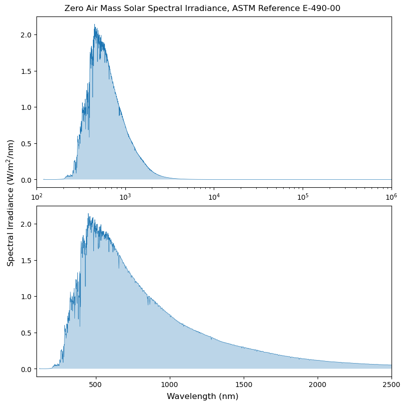
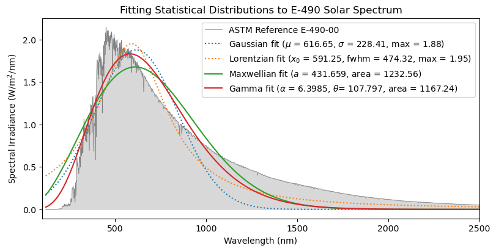
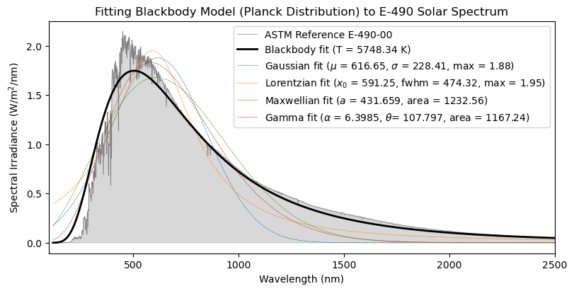

---
tags:
- Astropy
- Python library
- Model fitting
---

# Fitting the Solar Spectrum with `astropy.modeling`

`astropy` is a community Python library for astronomy that includes a comprehensive framework for working with data and programming in astronomical usecases. Within `astropy`, the subpackage `astropy.modeling` provides tools to represent models and fit data into models. `astropy.modeling` includes 6 modules of tools, which are 
1. `astropy.modeling.bounding_box`
2. `astropy.modeling.mappings`
3. `astropy.modeling.fitting`
4. `astropy.modeling.optimizers`
5. `astropy.modeling.statistic`
6. `astropy.modeling.separable`

These 6 modules, along with the top-level module (which is just the subpackage `astropy.modeling`) define and allow us to work with the class `Model`. The subpackage also include modules that pre-defines a wide variety of models for users to fit to data. Among them are Gaussians, cosine models, Lorentzians, to name a few.

The subpackage guide can be found [here](https://docs.astropy.org/en/stable/modeling/) with [API reference](https://docs.astropy.org/en/stable/modeling/reference_api.html), and [this](https://learn.astropy.org/tutorials/1_models-quick-fit.html) is a tutorial that introduces the use of basic models in `astropy.modeling` by demonstrating how to make quick fits of data with existing models. 

## Usage Example
To demonstrate usage with `astropy.modeling`, we will fit ASTM E-490-00, the Zero Air Mass Solar Spectral Irradiance according to different models, including the ideal blackbody model pre-defined in the subpackage. 

### Importing the Dataset

We import the data from [this National Laboratory of the Rockies website](https://www.nlr.gov/grid/solar-resource/spectra-astm-e490), in [Excel form](https://www.nlr.gov/media/docs/libraries/grid/e490_00a_amo.xls). A [PDF document](https://www.patarnott.com/atms749/pdf/SolarConstantZeroAirMass.pdf) introducing the dataset and listing it in table form is also available. 

In order to bypass bot detection, we send the fetch request as a browser. We then clean up the data by picking out the relavent columns and converting the wavelength units to nanometers. 


```python
import numpy as np
import matplotlib.pyplot as plt
import pandas as pd

# Add a browser-like User-Agent to bypass basic bot detection
df = pd.read_excel(
    'https://www.nlr.gov/media/docs/libraries/grid/e490_00a_amo.xls', 
    storage_options={'User-Agent': 'Mozilla/5.0'},
    usecols=['Wavelength, microns', 'E-490 W/m2/micron']
)
display(df.head())
display(df.describe())

wl = df['Wavelength, microns'].to_numpy() * 1000
spec_irrad = df['E-490 W/m2/micron'].to_numpy() / 1000
del df
```


<div>
<style scoped>
    .dataframe tbody tr th:only-of-type {
        vertical-align: middle;
    }

    .dataframe tbody tr th {
        vertical-align: top;
    }

    .dataframe thead th {
        text-align: right;
    }
</style>
<table border="1" class="dataframe">
  <thead>
    <tr style="text-align: right;">
      <th></th>
      <th>Wavelength, microns</th>
      <th>E-490 W/m2/micron</th>
    </tr>
  </thead>
  <tbody>
    <tr>
      <th>0</th>
      <td>0.1195</td>
      <td>0.0619</td>
    </tr>
    <tr>
      <th>1</th>
      <td>0.1205</td>
      <td>0.5614</td>
    </tr>
    <tr>
      <th>2</th>
      <td>0.1215</td>
      <td>4.9010</td>
    </tr>
    <tr>
      <th>3</th>
      <td>0.1225</td>
      <td>1.1840</td>
    </tr>
    <tr>
      <th>4</th>
      <td>0.1235</td>
      <td>0.0477</td>
    </tr>
  </tbody>
</table>
</div>


<div>
<style scoped>
    .dataframe tbody tr th:only-of-type {
        vertical-align: middle;
    }

    .dataframe tbody tr th {
        vertical-align: top;
    }

    .dataframe thead th {
        text-align: right;
    }
</style>
<table border="1" class="dataframe">
  <thead>
    <tr style="text-align: right;">
      <th></th>
      <th>Wavelength, microns</th>
      <th>E-490 W/m2/micron</th>
    </tr>
  </thead>
  <tbody>
    <tr>
      <th>count</th>
      <td>1697.000000</td>
      <td>1.697000e+03</td>
    </tr>
    <tr>
      <th>mean</th>
      <td>3.461289</td>
      <td>5.464911e+02</td>
    </tr>
    <tr>
      <th>std</th>
      <td>28.820729</td>
      <td>6.377916e+02</td>
    </tr>
    <tr>
      <th>min</th>
      <td>0.119500</td>
      <td>3.380000e-09</td>
    </tr>
    <tr>
      <th>25%</th>
      <td>0.543500</td>
      <td>5.894000e+01</td>
    </tr>
    <tr>
      <th>50%</th>
      <td>1.304000</td>
      <td>2.402000e+02</td>
    </tr>
    <tr>
      <th>75%</th>
      <td>2.152000</td>
      <td>9.123000e+02</td>
    </tr>
    <tr>
      <th>max</th>
      <td>1000.000000</td>
      <td>2.144000e+03</td>
    </tr>
  </tbody>
</table>
</div>


To get a sense of what the data looks like, we plot it twice. The first plot is the entire data set, on a log x-axis. We can see that most of the irradiance is concentrated in the 100–4000 nm span. In the second plot, we plot the data points within the 100–2500 nm range, on a linear x-axis. 


```python
fig, axs = plt.subplots(2, figsize=(8, 8), constrained_layout=True)

axs[0].semilogx(wl, spec_irrad, lw=0.5)
axs[0].fill_between(wl, spec_irrad, alpha=0.3)
axs[0].set_xlim(100, 1e6)

axs[1].plot(wl, spec_irrad, lw=0.5)
axs[1].fill_between(wl, spec_irrad, alpha=0.3)
axs[1].set_xlim(100, 2500)

fig.supxlabel("Wavelength (nm)")
fig.supylabel("Spectral Irradiance (W/m$^2$/nm)")
fig.suptitle("Zero Air Mass Solar Spectral Irradiance, ASTM Reference E-490-00")
plt.show()
plt.close()
```



    


This spectrum looks very familiar — in fact, there are many physical distributions with this general shape. Pretend that we don't know that the Sun can be modeled as a blackbody with absorption and emission lines, we can first try modeling it as a Gaussian distribution and a Maxwellian distribution. 

### Statistical Distributions

We can begin by fitting some well-known statistical distributions to the spectrum. Specifically, we will use two symmetrical distributions, the Gaussian and the Cauchy–Lorentz distribution, and two skewed distributions, the Maxwell–Boltzmann distribution and the gamma distribution. For the last two, we will define them as custom models with decorators. 


```python
from astropy.modeling import models, fitting
from astropy.modeling.models import custom_model
from scipy import special

fitter = fitting.TRFLSQFitter()

gauss_fit = models.Gaussian1D(
    amplitude=2.0,
    mean=500.0,
    stddev=200.0,
    bounds={
        'amplitude': (0, None),
        'mean': (100, 2500),
        'stddev': (10, 2000),
    }
)
fitter(gauss_fit, wl, spec_irrad, inplace=True)

lorentz_fit = models.Lorentz1D(
    amplitude=2.0,
    x_0=500.0,
    fwhm=300.0,
    bounds={
        'amplitude': (0, None),
        'x_0': (100, 2500),
        'fwhm': (10, 2000),
    }
)
fitter(lorentz_fit, wl, spec_irrad, inplace=True)

@custom_model
def maxwell(x, a=1, area=1361):
    return area * np.sqrt(2 / np.pi) * x**2 / a**3 * np.exp(- x**2 / 2 / a**2)

maxwell_fit = maxwell(a=400, area=1361)
fitter(maxwell_fit, wl, spec_irrad, inplace=True)

@custom_model
def gamma(x, shape=1, scale=1, area=1361):
    return area * scale**(-shape) / special.gamma(shape) * x**(shape-1) * np.exp(-x/scale)

gamma_fit = gamma(shape=9, scale=100, area=1361)
fitter(gamma_fit, wl, spec_irrad, inplace=True)

plt.figure(figsize=(8, 4), constrained_layout=True)
plt.plot(wl, spec_irrad, lw=0.5, color='gray', label="ASTM Reference E-490-00")
plt.fill_between(wl, spec_irrad, color='gray', alpha=0.3)
plt.plot(wl, gauss_fit(wl), ':', label=fr"Gaussian fit ($\mu$ = {gauss_fit.mean.value:.2f}, $\sigma$ = {gauss_fit.stddev.value:.2f}, max = {gauss_fit.amplitude.value:.2f})")
plt.plot(wl, lorentz_fit(wl), ':', label=fr"Lorentzian fit ($x_0$ = {lorentz_fit.x_0.value:.2f}, fwhm = {lorentz_fit.fwhm.value:.2f}, max = {lorentz_fit.amplitude.value:.2f})")
plt.plot(wl, maxwell_fit(wl), label=fr"Maxwellian fit ($a$ = {maxwell_fit.a.value:g}, area = {maxwell_fit.area.value:g})")
plt.plot(wl, gamma_fit(wl), label=fr"Gamma fit ($\alpha$ = {gamma_fit.shape.value:g}, $\theta$= {gamma_fit.scale.value:g}, area = {gamma_fit.area.value:g})")
plt.xlim(100, 2500)
plt.xlabel("Wavelength (nm)")
plt.ylabel("Spectral Irradiance (W/m$^2$/nm)")
plt.title("Fitting Statistical Distributions to E-490 Solar Spectrum")
plt.legend()
plt.show()
plt.close()
```



    


Although these statistical distributions follow the general shape of the solar spectrum, none of them really track the curve of the spectrum. Of course, we can quantize the error, but it is plain to see that they are not good fits. 

### Blackbody Model

We turn to models that have bearing on the actual physical processes involved in the emission of solar spectrum. One such model is the blackbody model, which imagines an object absorbing all incident radiation, reflecting and transmitting none, and emitting thermal radiation only dependent on its temperature. Here, we fit the associated the Planck distribution with respect to wavelength, and compare it to the previous fits. 


```python
@custom_model
def blackbody(wl, temperature=500):
    wl_m = wl * 1e-9
    h = 6.62607015e-34
    c = 299792458
    kBT = temperature * 1.380649e-23
    omega = np.pi * (6.957e8 / 1.496e11)**2
    return omega * 2 * h * c**2 / wl_m**5 / (np.exp(h*c/wl_m/kBT) - 1) * 1e-9

blackbody_guess = blackbody(temperature=5777)
blackbody_fit = fitter(blackbody_guess, wl, spec_irrad)

plt.figure(figsize=(8, 4), constrained_layout=True)
plt.plot(wl, spec_irrad, lw=0.5, color='gray', label="ASTM Reference E-490-00")
plt.fill_between(wl, spec_irrad, color='gray', alpha=0.3)
plt.plot(wl, blackbody_fit(wl), lw=2, c='k', zorder=6, label=f"Blackbody fit (T = {blackbody_fit.temperature.value:g} K)")
plt.plot(wl, gauss_fit(wl), '--', lw=0.5, label=fr"Gaussian fit ($\mu$ = {gauss_fit.mean.value:.2f}, $\sigma$ = {gauss_fit.stddev.value:.2f}, max = {gauss_fit.amplitude.value:.2f})")
plt.plot(wl, lorentz_fit(wl), '--', lw=0.5, label=fr"Lorentzian fit ($x_0$ = {lorentz_fit.x_0.value:.2f}, fwhm = {lorentz_fit.fwhm.value:.2f}, max = {lorentz_fit.amplitude.value:.2f})")
plt.plot(wl, maxwell_fit(wl), '--', lw=0.5, label=fr"Maxwellian fit ($a$ = {maxwell_fit.a.value:g}, area = {maxwell_fit.area.value:g})")
plt.plot(wl, gamma_fit(wl), '--', lw=0.5, label=fr"Gamma fit ($\alpha$ = {gamma_fit.shape.value:g}, $\theta$= {gamma_fit.scale.value:g}, area = {gamma_fit.area.value:g})")
plt.xlim(100, 2500)
plt.xlabel("Wavelength (nm)")
plt.ylabel("Spectral Irradiance (W/m$^2$/nm)")
plt.title("Fitting Blackbody Model (Planck Distribution) to E-490 Solar Spectrum")
plt.legend()
plt.show()
plt.close()
```



    


The blackbody model is a marked improvement from the previous models. However, we can still see that there are regions with significant errors. The sun, after all, is not an idealized blackbody. Furthermore, in the process of emitting the electromaganetic radiation, there are numerous emission and absorption processes, which contributes to the jaggedness of the solar spectrum. Fortunately, since the dataset we are modeling is taken above the atmosphere, we don't need to consider its modification to the spectrum. 

### Further Modeling

To elaborate the model beyond what we have, we can try to make a compound model with `astropy.modeling` so as to fit the most prominent absorption and emission lines with a steep Gaussian, and investigate how the wavelengths of those lines reveal about the sun. In addition, we can also adjust the underlying blackbody model to take into account the complex stellar processes, which also involve many different layers of abstraction and approximation. 
