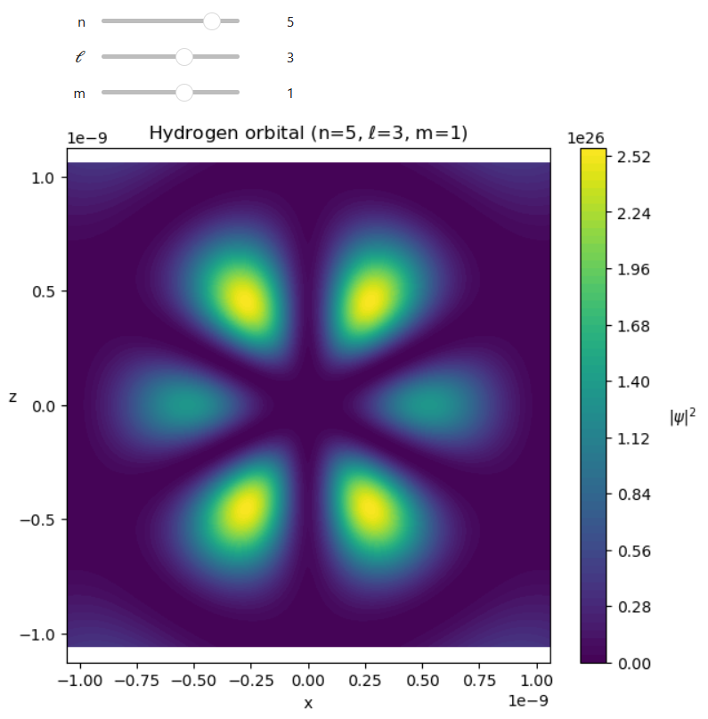

---
tags:
 - Quantum mechanics
 - Functions
 - visualizations
---

### Interactive Visualizations ###

Visualizations allow the physics of a given mathematical result to be communicated more clearly in a graphical form. Some mathematical results vary based on important parameters, though, with each result needing to represent individually. Instead of having separate visualizations for each result, a single one can be created that updates based on user-input parameter values, forming an interactive visualization.

#### Implementation ####

A method for creating these visualizations is using the "ipywidgets" library. This library allows the creation of sliders or text boxes for selecting input values and allows the creation of interactive graphics. Constraints of the system being visualized might require a specific type of input. For example, if only an integer input value is useful, the "IntSlider" function can can be used for a slider that allows only integer values within a set range, and, any value can be used, the "FloatText" function allows any float value to be input to a text box. When a new value is set for a given parameter, the visualization can be updated using the "interactive_output" function.


#### Example Code ####

An example of a mathematical result that is dependent on given parameters are the probability densities for the electron orbitals in a hydrogen atom. The wavefunctions that solve the Schrodinger equation are dependent on the principle quantum number $n$, the azimuthal quantum number $\ell$, and the magnetic quantum number $m$. Below, the "radial_hydrogen" function calculates the $r$ dependent part of the wavefunction solutions, and the "plot_hydrogen" function combines this radial solution with the spherical harmonic solutions and plots the probability density using a contour plot from the "matplotlib" library.


```python
import numpy as np
import matplotlib.pyplot as plt
import scipy.special as sp
import math
import ipywidgets as widgets
from IPython.display import display

#Bohr radius
a0_num = 5.292e-11

def radial_hydrogen(r, n, l):
    rho = 2 * r / (n * a0_num)

    #Calculates normalization factor
    norm_factor = np.sqrt((2/(n*a0_num))**3 *math.factorial(n-l-1) /(2*n*math.factorial(n+l)))

    #Calculates Laguerre polynomial
    laguerre = sp.genlaguerre(n-l-1, 2*l+1)
    
    #Returns radial solution for spherical harmonic
    return norm_factor * np.exp(-rho/2) * rho**l * laguerre(rho)


def plot_hydrogen(n, l, m):
    
    #Checking the dependencies of the quantum numbers
    if l >= n or abs(m) > l:
        print("Invalid quantum numbers")
        return
    
    #Creating our X and Z axis and turning them into 2D arrays of their values
    x = a0_num*np.linspace(-20, 20, 400)
    z = a0_num*np.linspace(-20, 20, 400)
    X, Z = np.meshgrid(x, z)

    #Calculating the radius and angle from the origin at each point in the grid
    R = np.sqrt(X**2 + Z**2)
    TH = np.arccos(Z / (R + 1e-12))

    #Solving for the radial component and the spherical harmonic for the given quantum numbers
    Rad = radial_hydrogen(R, n, l)
    Y = sp.sph_harm_y(l, m, TH, 0)

    #Pluggin in our components to find our wave function and from there calculating the probability density by taking the norm squared
    psi = Rad * Y
    prob_density = np.abs(psi)**2

    #Plotting the probability density on a contour plot
    plt.figure(figsize=(7,6))
    plt.contourf(X, Z, prob_density, levels=80, cmap="viridis")
    
    #Setting colorbar and plot components
    cbar = plt.colorbar()
    cbar.set_label(r"$|\psi|^2$", rotation=0, labelpad=20)
    plt.title(rf"Hydrogen orbital (n={n}, $\ell$={l}, m={m})")
    plt.xlabel("x")
    plt.ylabel("z", rotation = 'horizontal')
    plt.axis("equal")
    plt.show()
```

While the probability densities for the hydrogen atom orbitals are three dimensional, they can be represented by slices in the xz-plane. These probability densities, though, look very different based on combinations of $n$, $\ell$, and $m$ values. Therefore, a graph can be created to visualize a given orbital specified by user-input quantum number values. Since quantum numbers can only be integers, the best widget function to use is the "IntSlider" function, as shown in the next code block.


```python
n_slider = widgets.IntSlider(value=2, min=1, max=6, description='n')
l_slider = widgets.IntSlider(value=1, min=0, max=5, description=r'$\ell$')
m_slider = widgets.IntSlider(value=0, min=-5, max=5, description='m')
```

With slider objects created to hold the values for the quantum numbers, a function must be defined that will call the "plot_hydrogen" function to remake the graph of probability density whenever a quantum number is changed, as shown below.


```python
def update(n, l, m):
    plot_hydrogen(n, l, m)
```

Now, a user-interface object can be created that contains the three sliders. This can be accomplished using the "VBox" function, which places the sliders in vertical alignment. If a horizontal alignment was preferred, the "HBox" function could be used.


```python
ui = widgets.VBox([n_slider, l_slider, m_slider])
```

Finally, the "interactive_output" function can be used to call the "update" function, which plots the probability density determined by the input quantum numbers. The interactive_output function allows the parameters of the "output" function to be controlled by the values of the sliders.


```python
out = widgets.interactive_output(update,{'n': n_slider, 'l': l_slider, 'm': m_slider})
```

With all the components of the visualization created, it simply needs to be shown using the "display" function from the "IPython" library.


```python
display(ui, out)
```

The displayed user interface and graph will look like the following image.

